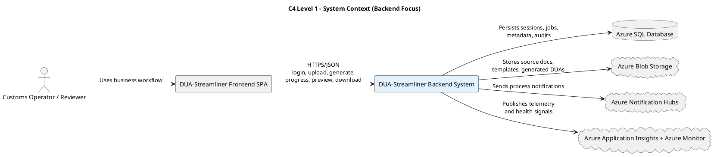
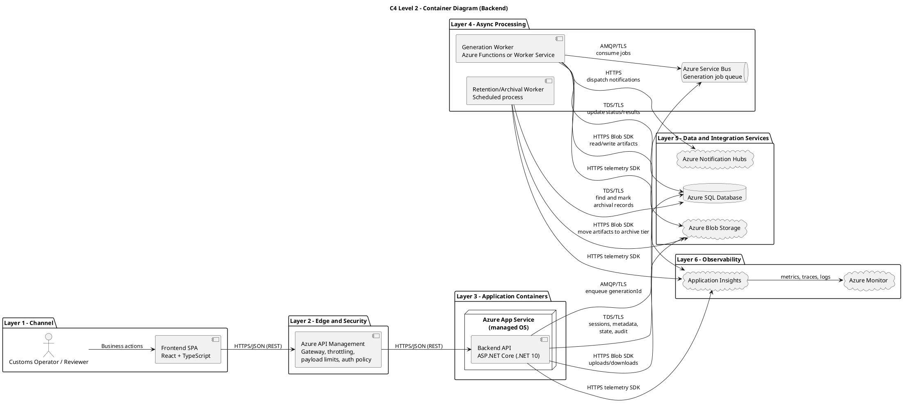

# Backend C4 Diagrams (Context, Container, Code)

Base source: backend architecture defined in [README.md](/README.md) under `# 2. Backend Design`.

Scope note: this document includes only `Context`, `Container`, and `Code` diagrams (no Component diagram), matching the project requirement.

## 1) C4 Level 1 - Context Diagram (Business/Executive View)

### System boundary and external actors/systems
- `Customs Operator / Reviewer`: uploads documents, starts generation, reviews and approves output.
- `DUA-Streamliner Frontend SPA`: user-facing channel that consumes backend APIs.
- `DUA-Streamliner Backend System` (system under analysis): executes authentication, upload, generation orchestration, preview, download, and archival.
- `Azure SQL Database`: operational and audit metadata.
- `Azure Blob Storage`: source files, templates, generated artifacts.
- `Azure Notification Hubs`: user notifications for progress/completion.
- `Azure Application Insights + Azure Monitor`: telemetry, monitoring, and diagnostics.

## 2) C4 Level 2 - Container Diagram (Technology + Cloud Services + Flows)

### Containers and technology
- `Frontend Channel`: React SPA (TypeScript), browser-hosted.
- `API Edge`: Azure API Management (gateway, rate limits, payload limits, auth policies).
- `Backend API Container`: ASP.NET Core (.NET 10) on Azure App Service (managed OS by Azure, Linux/Windows).
- `Async Queue`: Azure Service Bus for generation jobs.
- `Generation Worker Container`: Azure Functions or Worker Service for async pipeline (`parse -> extract -> map -> validate -> render`).
- `Retention/Archival Worker`: scheduled backend process for 90-day lifecycle transition.
- `Data and integrations`: Azure SQL, Blob Storage, Notification Hubs.
- `Observability`: Application Insights and Azure Monitor.

### Interaction protocols
- Client to gateway/API: `HTTPS + JSON (REST/OpenAPI)`.
- API/Worker to SQL: `TDS over TLS`.
- API/Worker to Blob: `HTTPS (Azure Blob SDK/REST)`.
- API to queue and worker from queue: `AMQP over TLS`.
- API/Worker to Notification Hubs: `HTTPS`.
- API/Worker to observability: telemetry SDK over `HTTPS`.

## 3) C4 Level 4 - Code Diagram (UML Classes + Layer Markers)

### Folder-oriented view (backend monorepo target)
- `duabusiness/src/DUA.Backend/domains/dua-generation/controllers`
- `duabusiness/src/DUA.Backend/domains/dua-generation/services`
- `duabusiness/src/DUA.Backend/domains/dua-generation/models`
- `duabusiness/src/DUA.Backend/domains/dua-generation/repositories`
- `duabusiness/src/DUA.Backend/acls/document-intake-to-dua-generation`
- `duabusiness/src/DUA.Backend/acls/template-management-to-dua-generation`
- `duabusiness/src/DUA.Backend/shared`

### Design patterns represented
- `Facade + Adapter`: ACL contracts between bounded contexts.
- `Repository + Unit of Work`: persistence boundary and transaction consistency.
- `Template Method + Strategy + Factory`: generation pipeline behavior by format/rule profile.
- `Specification`: precondition and template validation rules.
- `Saga + Outbox`: long-running orchestration and reliable event publication.

```plantuml
@startuml
title C4 Level 4 - Code Diagram (DuaGeneration)
left to right direction
skinparam shadowing false
skinparam classAttributeIconSize 0

package "Presentation Layer\n/domains/dua-generation/controllers" #E3F2FD {
  class GenerationController {
    +startGeneration(request): Response202
    +getProgress(generationId): GenerationProgressReadModel
    +getErrors(generationId): ErrorList
  }
}

package "Application Layer\n/domains/dua-generation/services" #E8F5E9 {
  class GenerationApplicationService {
    +queueGeneration(command): Guid
    +markRunning(generationId): void
    +markCompleted(generationId): void
    +markFailed(generationId, reason): void
  }

  class GenerationWorker {
    +handleGenerationJob(generationId): void
  }

  class GenerationSagaManager {
    +start(generationId): void
    +complete(generationId): void
    +fail(generationId, reason): void
  }

  class StandardGenerationPipeline {
    +run(generationId): PipelineResult
  }
}

package "Domain Layer\n/domains/dua-generation/models + services" #FFF8E1 {
  abstract class BaseGenerationPipeline {
    +run(generationId): PipelineResult
    #parse(): ParsedDocuments
    #extract(): ExtractionResult
    #map(): CanonicalDuaData
    #validate(): ValidationResult
    #render(): GeneratedArtifact
  }

  interface IDocumentProcessorStrategy {
    +process(document): ExtractionResult
  }

  class PdfProcessorStrategy {
    +process(document): ExtractionResult
  }

  class DocxProcessorStrategy {
    +process(document): ExtractionResult
  }

  class DocumentProcessorStrategyFactory {
    +create(formatProfile): IDocumentProcessorStrategy
  }

  class GenerationPreconditionsSpecification {
    +isSatisfiedBy(session): bool
  }

  class TemplateIsValidSpecification {
    +isSatisfiedBy(template): bool
  }

  class GenerationJob {
    +Id: Guid
    +Status: GenerationStatus
    +CorrelationId: string
  }

  class GenerationProgressReadModel {
    +GenerationId: Guid
    +Status: string
    +ProgressPercent: int
    +CurrentStep: string
    +LastTransitionAt: DateTime
  }
}

package "ACL Layer\n/acls/*-to-dua-generation" #F3E5F5 {
  class DocumentIntakeToDuaGenerationFacade {
    +getEligibleDocuments(sessionId): DocumentBatch
  }

  class DocumentBatchToGenerationRequestAdapter {
    +adapt(batch): GenerationInput
  }

  class TemplateManagementToDuaGenerationFacade {
    +getActiveValidTemplate(sessionId): DuaTemplate
  }
}

package "Infrastructure Layer\n/repositories + shared" #F5F5F5 {
  interface IGenerationJobRepository {
    +createQueuedJob(session): Guid
    +updateState(generationId, state): void
    +saveResult(generationId, result): void
    +getProgress(generationId): GenerationProgressReadModel
  }

  class SqlGenerationJobRepository {
    +createQueuedJob(session): Guid
    +updateState(generationId, state): void
  }

  interface IUnitOfWork {
    +begin(): void
    +commit(): void
    +rollback(): void
  }

  interface IOutboxPublisher {
    +publish(event): void
  }

  class ServiceBusOutboxPublisher {
    +publish(event): void
  }
}

GenerationController --> GenerationApplicationService : uses
GenerationWorker --> GenerationApplicationService : uses
GenerationWorker --> GenerationSagaManager : orchestrates

GenerationApplicationService --> GenerationPreconditionsSpecification : validates
GenerationApplicationService --> TemplateIsValidSpecification : validates
GenerationApplicationService --> DocumentIntakeToDuaGenerationFacade : ACL facade
GenerationApplicationService --> TemplateManagementToDuaGenerationFacade : ACL facade
DocumentIntakeToDuaGenerationFacade --> DocumentBatchToGenerationRequestAdapter : translates

GenerationApplicationService --> IGenerationJobRepository : repository contract
SqlGenerationJobRepository ..|> IGenerationJobRepository : implements
GenerationApplicationService --> IUnitOfWork : transaction boundary

GenerationApplicationService --> IOutboxPublisher : publishes domain events
ServiceBusOutboxPublisher ..|> IOutboxPublisher : implements

GenerationApplicationService --> BaseGenerationPipeline : executes
StandardGenerationPipeline --|> BaseGenerationPipeline : template method
BaseGenerationPipeline --> DocumentProcessorStrategyFactory : strategy selection
DocumentProcessorStrategyFactory --> IDocumentProcessorStrategy : creates
PdfProcessorStrategy ..|> IDocumentProcessorStrategy : implements
DocxProcessorStrategy ..|> IDocumentProcessorStrategy : implements

IGenerationJobRepository --> GenerationJob : persists aggregate
IGenerationJobRepository --> GenerationProgressReadModel : projects read model
@enduml
```

