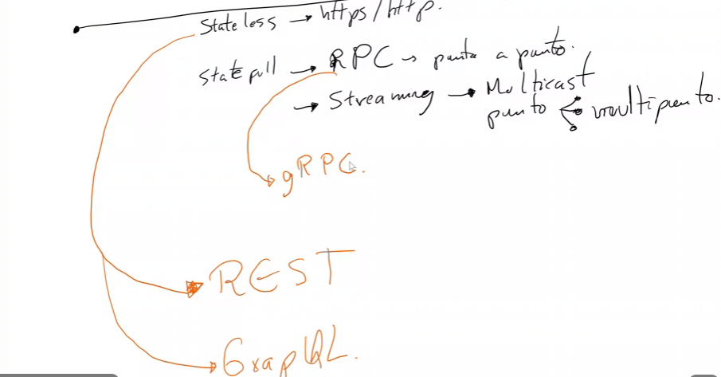

# Technology Stack

- Depende de la escalabilidad del negocio, es decir, son 100 usuarios o son 1000000 usuarios
- Estoy procesando bytes/kilobytes, o tengo que procesar megas o gigas
- Es con esperas o sin esperas
- Es síncrono o asíncrono
- Tengo que interconectar con algo en la nube?
- Cuál es la disponibilidad de desarrolladores o ingenieros en esta plataforma?
- Stateless (https/http, rest o GraphQL) o statefull (rpc - punto a punto, streaming - multicast, punto multipunto)?

Cómo es la comunicación?

REST: Funciones predeterminadas y programadas. Aquí explícitamente tengo que crear un método que tome el id del user a retornar y ya está predefinido la información que retorna, lo que son columnas o atributos
GraphQL: Consultas variables donde el cliente es el que envía indicaciones al server de como quiere extraer la información de un recurso, usa un lenguaje. Es útil cuando hay mucha diversidad de clientes que requieren ver y consultar la información de forma diferente

## Hosting
Capacidades

### Servidor: 
- Express
- IIS
- Tomcat
- etc

### Hosting Services: 
- Amplify
- Vercel
- AppSer

### Headless: 
- Supabase
- Firebase
- Colorful

### Serverless
Sin servers o con servers? suelen usar K8s

---
Necesitamos definir
- Cantidad de conexiones concurrentes?
- Hay pool de conexiones?
- Hay cache de contenido?
- Hay manejo de sesiones y encriptado?
- Throttling, que se hace si se están recibiendo demasiados requests o kb?
- Blacklists
- Que contenido se puede entregar y que no
- CORS
- Hay muchas variables y beneficios que nos da un servicio versus otro
- Si es con infraestructura administrada o no administrada

## Technology Stack
- REST API, HTTPS
- Azure-API Management + Azure App Service
- API Standard with OpenAPI
- For asynchronous operations and notifications use Azure Notifications Hubs
- No load balancing required
- API coding language .NET, APS .NET Core
- This is a monorepo solution, sharing the repository with the frontend, backend folder: duabusiness

Balanceo de carga?