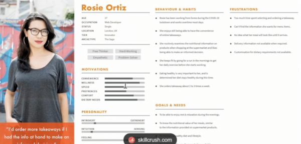
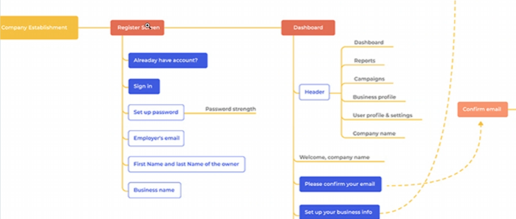
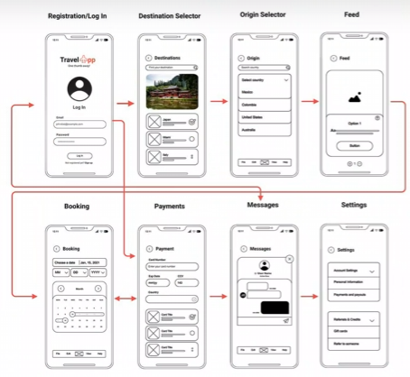

# Diseño de frontend

Incluye los atributos de usabilidad deseables del aplicativo, un diseño preliminar del UX a modo wireframes, y las evidencias de las pruebas de UX con usuarios reales que validan diseño diseño preliminar

## UX Design Process

El AI se va a basar en diseños existentes, los verdaderos UXers son creativos, imaginan cosas nuevas y generan diseños personalizados

### Escenario A 
El proyecto ya se está haciendo, estoy creando el diseño de un proyecto "In progress" -> ya están pagando $, ya hay fechas, ya hay recursos

**User Persona:** Mapear cuál es el perfil de la persona que va a usar esta aplicación. Una aplicación puede tener varios User Persona

#### Ciclo del UX Design

1. Research & Strategy: Trabajan con el cliente para definir cómo se usa el app, qué trabajo hace, etc. Busca que el sistema esté organizado para cumplir con el 80% del trabajo desde las pantallas principales
2. Information Architecture: Orden en que se presenta la información para conseguir una tarea de un tipo de USER PERSONA
   
   

   Son diagramas que indican la conexión o los flujos de una infromación a otra

3. Sketches & Interaction Flows: Sketches a mano alzada de cómo podría lucir la aplicación

4. Wireframe Development: Mockups, se recomienda que sean en blanco y negro para que el enfoque sea en hacer la tarea. Puede ser a papel, no es un prototipo.

   

    Los cuadros con equis son donde debrían ir imágenes

5. UX Testing: Normalmente los UXers lo hacen en papel, imprimen todo y hacen recortes. Para los usability tests le piden a usuarios que intenten realizar una función en papel. Si van tocando en partes incorrectas del papel, se va dando cuenta que el diseño tal vez no sea tan claro. Se hace contra los User Persona. Se suele hacer presencial, es muy importante entender y elegir los usuarios correctos. También se pueden usar aplicaciones como Maze, Looppanel, FigJam, Figma. Algunos traen Eye Tracking para ver si hay elementos distractorios y que se pueda reforzar más lo que realmente se quiere.

6. UI Design: Con todo lo generado previamente, hacemos ya un prototipo funcional de la aplicación.

### Escenario B
El cliente quiere ver "wireframes" o "mockups" o "prototipo" antes de decidir si hace el proyecto o no. Usamos IA para generar algo para el cliente a bajo costo. DISCLAIMER: Esto no es versión final, se requiere todo el UX Design

## UX UI Analysis

